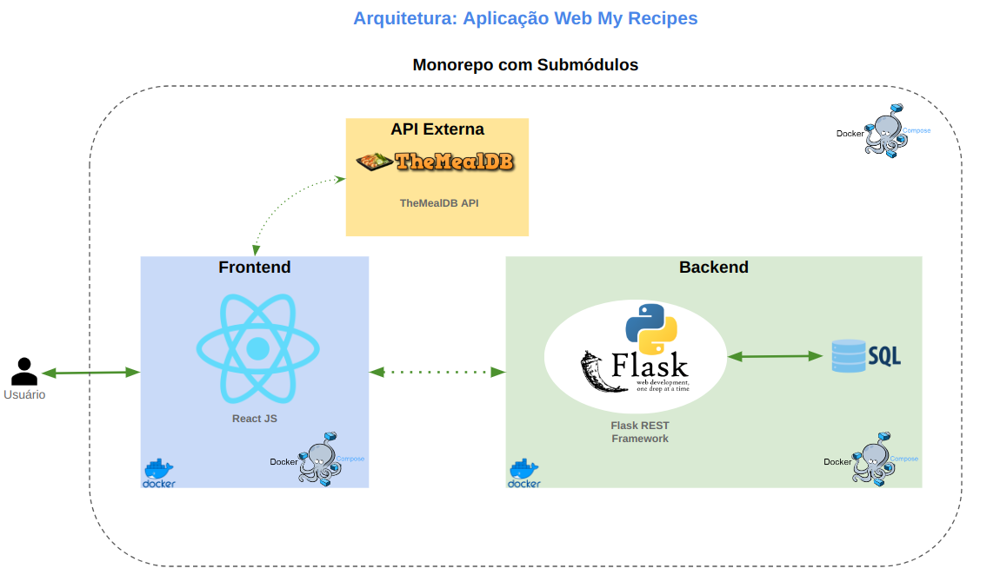

Este projeto contém os requisitos realizados por _[Anna Beatriz Garcia Trajano de Sá](www.linkedin.com/in/anna-beatriz-trajano-de-sá)_ enquanto cursava o curso de Pós-Graduação da PUC-RIO em Engenharia de Software. 
Ele engloba as disciplinas estudadas na primeira sprint (Desenvolvimento Full Stack Básico) e na quarta sprint (Arquitetura de Software) 

Esse repositório engloba a parte Front-end e Back-end da aplicação.

# My Recipes App - All 

Neste projeto desenvolvi um app de receitas, utilizando o que há de mais moderno dentro do ecossistema React: Hooks e Context API!

Nele será possível ver, criar, atualizar, filtrar (por categoria) e deletar receitas!

A base de dados foram duas APIs distintas, uma para receitas já existentes e outra de criação própria para poder cadastrá-las em um banco de dados.

Este repositório contém os componentes da aplicação, o Front-end e o Back-end por meio de submódulos. Isso garante que cada serviço ainda mantenha o seu próprio repositório, 
permitindo um controle mais granular e independente.

É possível visualizar essa estrutura no fluxograma abaixo.

## Arquitetura do Projeto 

Com o intuito de facilitar o entendimento do funcionamento da aplicação como um todo, segue abaixo um fluxograma que exemplefica a arquitetura do projeto e os seus componentes:

 

## Como executar através do Docker
 
Certifique-se de ter o Docker instalado e em execução em sua máquina.

Navegue até o diretório que contém o arquivo **docker-compose.yml**. Execute, **como administrador**, o seguinte comando para atualizar os submódulos e subir o container do Docker:

```javascript
   git submodule init
```
```javascript
   git submodule update
```
```javascript
   git submodule foreach git checkout main
```
```javascript
   git submodule foreach git pull
```
```javascript
   docker compose up -d
```
## Repositórios 
[Front-end](https://github.com/annatrajano/my_recipes_front)<br>
[Back-end](https://github.com/annatrajano/my_recipes_api)<br>

